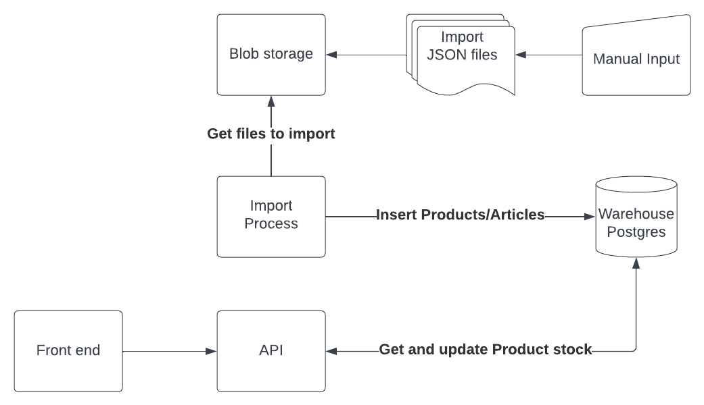

# 📦 Warehouse Application

## Stack

* [Flask](https://flask.palletsprojects.com/) for simple HTTP layer
* [marshmallow](https://flask.palletsprojects.com/) object serialisation/deserialization, defining API schemas
* [min.io](https://min.io/) blob storage used for inventory import
* [PostgreSQL](https://www.postgresql.org/) database for storing inventory and handling transactions
* [SQLAlchemy](https://www.sqlalchemy.org/) used in Python for handling database logic

## Components

This monorepo contains following components:

* [backend](backend/README.md)

## High level architecture and data flow



## Configuration

No need to configure anything for local deployment, everything runs with reasonable
defaults.

## Running 

Requirement: Docker Compose `1.28.0` 

### Application

```bash
docker compose --profile app up -d 
```

### Backend tests

```bash
docker compose --profile backend-tests up --exit-code-from pytest
```


## Demo scenario

1. Run application : `docker compose --profile app up -d`
2. Navigate to block storage in browser [http://localhost:9001/buckets/warehouse-import-files/browse](http://localhost:9001/buckets/warehouse-import-files/browse) with following credentials
   * user: `minio`
   * pass: `minio-secret`
3. Add `*.json` files with import to the bucket
4. Navigate to Swagger UI:
   1. retrieve initial Products stock [http://localhost:8080/#/products/post_products__product_id__sale](http://localhost:8080/#/products/post_products__product_id__sale)
   2. register sale using example payload [http://localhost:8080/#/products/post_products__product_id__sale](http://localhost:8080/#/products/post_products__product_id__sale)
   3. retrieve current Products stock