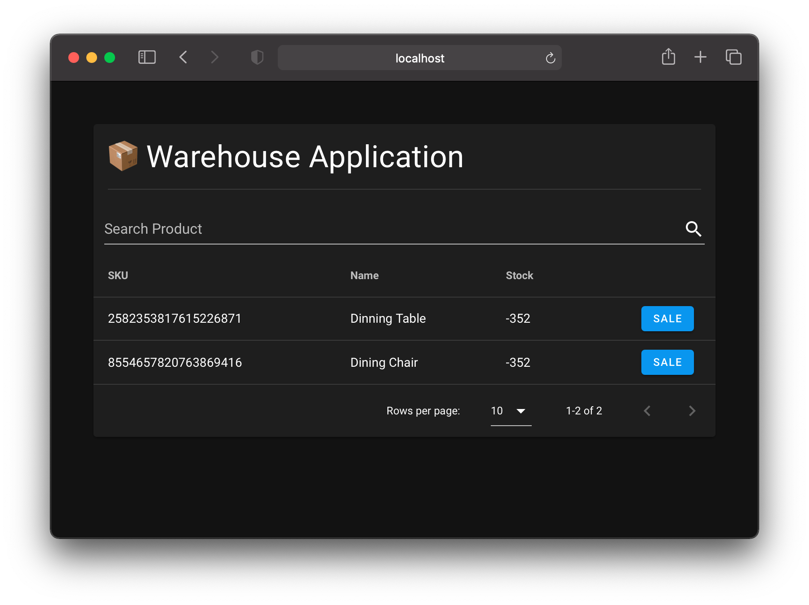

# Warehouse Backend

Just a simple frontend that uses Warehouse API.



## @TODO

* Proper configuration solution that allows mounting configuration on runtime (ex. K8 configmaps or env variables)
* Decouple state management from components
* Move Product pagination and search to backend
* Adjust UX so it fits mobile usage patterns
* Enable TypeScript support
* Extend functionality by:
  * retrieving Product sales history
  * retrieving Product stock changes history

## Project setup
```
npm install
```

### Compiles and hot-reloads for development
```
npm run serve
```

### Compiles and minifies for production
```
npm run build
```

### Lints and fixes files
```
npm run lint
```
